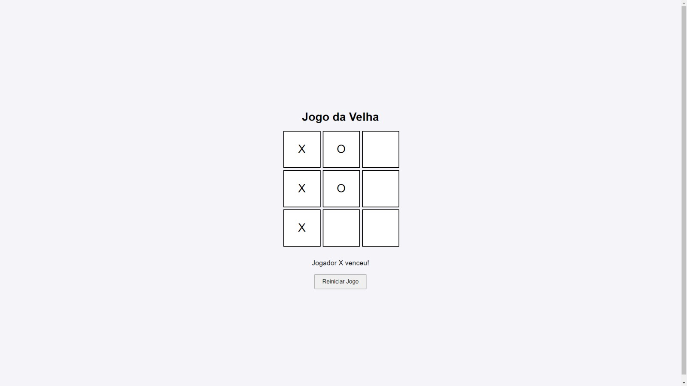

# Projeto Jogo da velha com JavaScript
Projeto de um jogo da velha (tic-tac-toe) utilizando HTML, CSS e JavaScript. Esse projeto cria um tabuleiro de 3x3 onde dois jogadores (X e O) podem se alternar para jogar.

<h1 align="center">
  Jogo da Velha
</h1>

  

## 📔 Estrutura do projeto:

HTML: Cria a estrutura do tabuleiro.

CSS: Estiliza o tabuleiro e o design geral.

JavaScript: Lida com a lógica do jogo, alternância de jogadores e detecção de vitória/empate.

Explicação:

HTML:

Cria o título do jogo e o tabuleiro com 9 células (div), onde cada célula possui um atributo data-index para controlar a posição no jogo.
Um botão "Reiniciar Jogo" é usado para reiniciar a partida.

CSS:

Estiliza o tabuleiro para parecer um jogo da velha.
As células têm um tamanho fixo (100px x 100px), com uma fonte grande para exibir "X" ou "O" claramente.

JavaScript:

Lida com a alternância entre os jogadores, a verificação de combinações vencedoras e a reinicialização do jogo.
A função checkWinner() verifica todas as combinações vencedoras e exibe uma mensagem quando há um vencedor ou se o jogo termina em empate.
O evento de clique nas células permite que os jogadores façam suas jogadas e atualizem o estado do jogo.